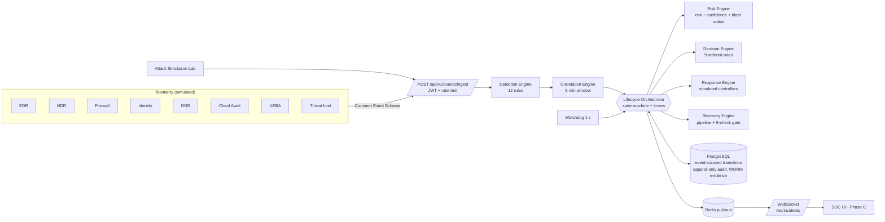
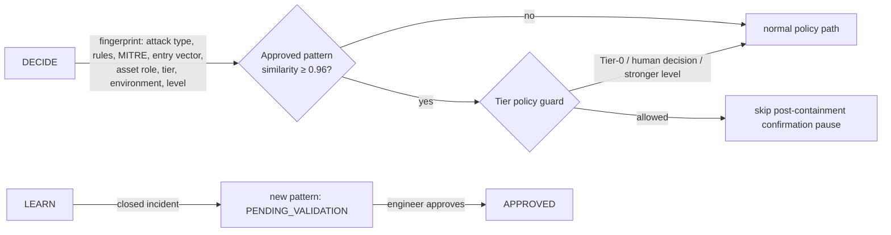
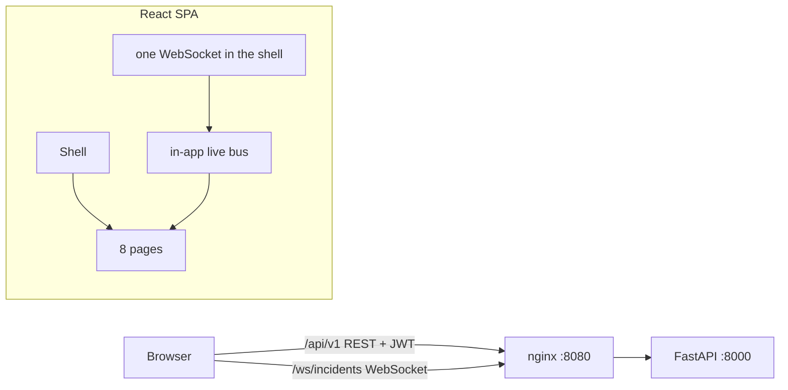

# ACRS v2 — Architecture Blueprint

> **Simulation Only — No Real Network Operations.**
> Governing principle: *isolate the infected part, not the whole organisation.*

## 1. Components



## 2. Incident state machine

```mermaid
stateDiagram-v2
  [*] --> DETECT
  DETECT --> UNDERSTAND --> IDENTIFY_ENTRY --> ATTRIBUTE_ASSET --> RISK --> DECIDE
  DECIDE --> CONTAIN: auto
  DECIDE --> PENDING_APPROVAL: needs a human
  DECIDE --> MONITOR: low risk
  PENDING_APPROVAL --> CONTAIN: approved
  MONITOR --> CONTAIN: approved
  CONTAIN --> VERIFY
  CONTAIN --> ESCALATED: deadline 7s / 15s / 90s
  VERIFY --> REMEDIATE
  VERIFY --> ESCALATED: probes failed
  REMEDIATE --> REMEDIATE: gate failed (retry once)
  REMEDIATE --> HARDEN
  REMEDIATE --> ESCALATED: gate failed twice
  HARDEN --> OBSERVE
  OBSERVE --> REMEDIATE: IoB returned
  OBSERVE --> RE_ENTRY: 60s clean
  RE_ENTRY --> LEARN --> CLOSE
  ESCALATED --> VERIFY: engineer RUN_VERIFICATION
  ESCALATED --> REMEDIATE: engineer RUN_VERIFICATION
  CLOSE --> [*]
  note right of ESCALATED: Emergency Queue\n(the only mandatory human step)
```

Any non-terminal state can go to `ROLLED_BACK` (false positive: every action is undone in reverse order).

## 3. Timers

| Timer | Default | Meaning | On expiry |
|---|---|---|---|
| Tier-0 | 7 s | restrictive emergency containment must be verified | Emergency Queue |
| Tier-1 | 15 s | surgical isolation must be verified | Emergency Queue |
| Tier-2 | 90 s | full isolation must be verified | Emergency Queue |
| Observation | 60 s | 6 checks, any IoB restarts remediation | re-entry |
| MTTC target | 60 s | reported KPI (not a cut-off) | — |

Deadlines are stored in `incidents.deadline_at`, so the watchdog escalates even if the worker that owned the incident crashes.

## 4. Trust boundaries

```
+---------------------------- untrusted -----------------------------+
|  telemetry connectors / simulator   --->  JWT + schema validation  |
+-------------------------------------------|------------------------+
                                            v
+---------------------------- ACRS core ------------------------------+
|  engines (pure, deterministic, no LLM)  |  orchestrator (CAS moves)  |
|  RBAC: viewer < analyst < engineer < admin                           |
+-------------------------------------------|--------------------------+
                                            v
+---------------------------- enforcement (SIMULATED) ----------------+
|  network | perimeter | endpoint | identity | cloud | dns | database  |
|  every command -> audit_logs (actor, action, target, reason, result) |
+----------------------------------------------------------------------+
```

## 5. Decisions agreed in design review

1. Tier-0: the 7 s timer covers restrictive actions only; full isolation needs **two different approvers**.
2. The two-person rule applies to Tier-0 only.
3. Medium band (60 ≤ risk < tier threshold): automatic `RESTRICT`, pause before remediation.
4. MTTC target 60 s; 90 s is the Tier-2 cut-off to the Emergency Queue.
5. Response Memory (Phase B): ≥96 % similarity, engineer-approved patterns only, never above tier policy.
6. No real CrowdStrike / Entra ID adapters: simulated controllers behind one `Controller` protocol.

## 6. Phase B — Response Memory and reports



* `engines/memory.py` is pure: `fingerprint`, weighted `similarity` (Jaccard for rule and MITRE sets),
  `best_match` (approved only) and `may_apply` (the tier-policy guard).
* Memory can only remove the confirmation pause for a response an engineer already validated.
  It never raises the containment level, never turns a human-approval decision into an automatic one, never touches Tier-0.
* `engines/reports.py` builds the hourly KPI report from incidents in a window. The orchestrator's `report_loop`
  stores one report per (scaled) hour in the append-only `hourly_reports` table.
* The circuit breaker counts automatically contained incidents that are still open, so finished demos do not
  block new ones.

## 7. Phase C — Console



* One WebSocket per tab lives in the shell; pages subscribe to an in-app bus and refetch (debounced) when a relevant
  message arrives, so the REST API stays the single source of truth.
* Hash routing (`#/incidents/<id>`) works behind any static server.
* The JWT is kept in `sessionStorage` and dropped on any 401.
* Arabic RTL is the default; layout uses CSS logical properties so RTL and LTR mirror without separate stylesheets.
* Colour encodes state only: cyan running, green contained/closed, amber waiting for a human, red emergency,
  violet response memory.
