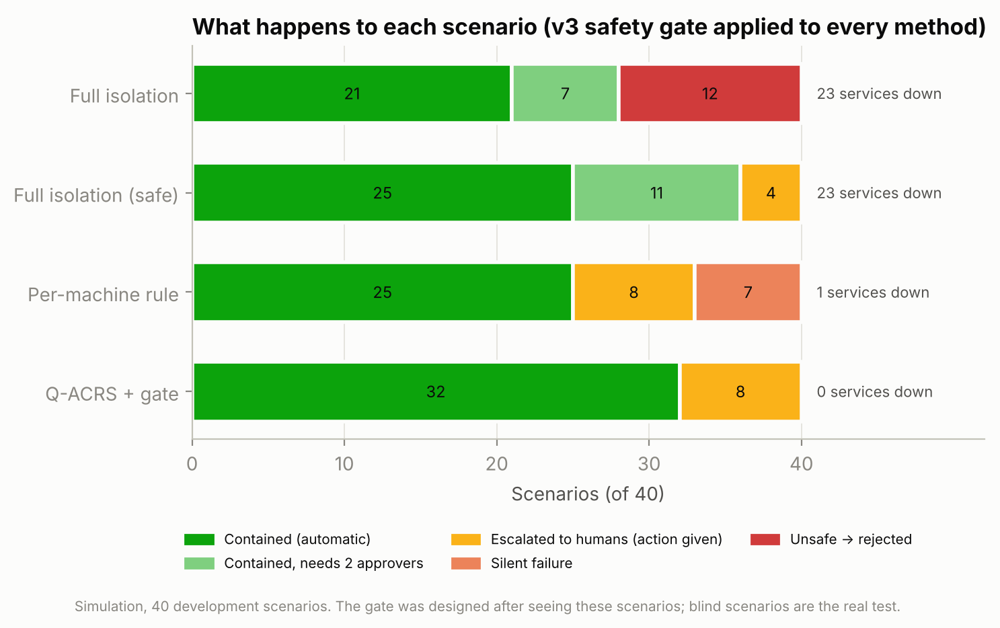
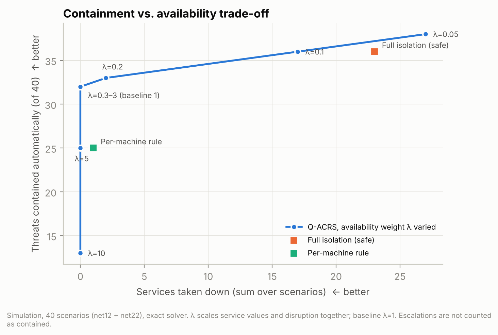
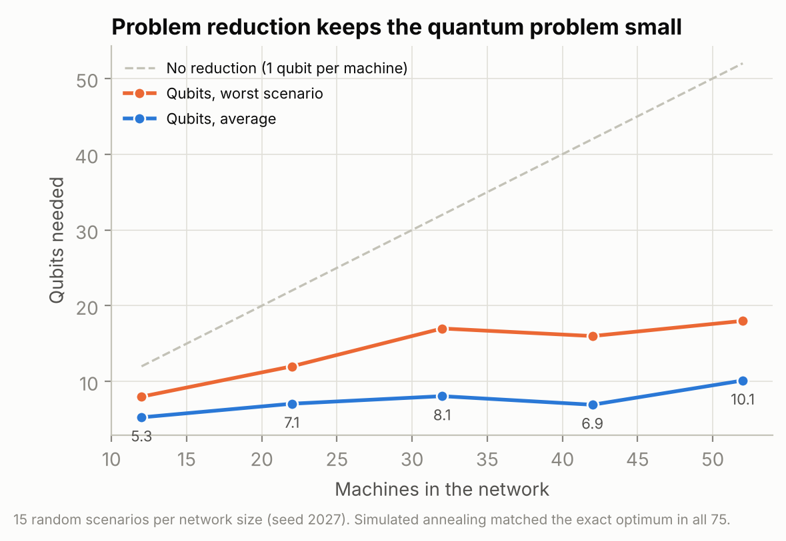

# Q-ACRS — Results v3

> Generated by `python -m qacrs.report_v3` from `backend/qacrs/results/v3/`. Criteria were fixed in advance in `docs/qacrs/PREREGISTRATION_v3.md`. All results are **simulation** unless a section says hardware.

## E1 — Escalation gate (40 development scenarios)

| Method | Contained | …needs 2 approvers | Escalated (action given) | Silent failures | Rejected (unsafe) | Services down |
|---|---|---|---|---|---|---|
| Full isolation | 28 | 7 | 0 | 0 | 12 | 23 |
| Full isolation (safe) | 36 | 11 | 4 | 0 | 0 | 23 |
| Per-machine rule | 25 | 0 | 8 | 7 | 0 | 1 |
| Q-ACRS | 32 | 0 | 8 | 0 | 0 | 0 |

Q-ACRS: 0 silent failures (v2 had 8), with 9 concrete human actions across 8 scenarios. **Caveat (pre-registered):** the gate was designed after seeing these scenarios, so this shows the gate works as built, not that it generalises.

H1-v3 on the development set (not a new test): containment ratio 0.889, fewer services down: True → supported.

## E2 — Weight sensitivity and trade-off

| Factor | Levels tested | Max decisions changed within ±30% | First level that changes any decision | Verdict |
|---|---|---|---|---|
| `f_service` | 0.5, 0.7, 0.8, 0.9, 1, 1.1, 1.2, 1.3, 1.5 | 0/40 | none (up to ±50%) | robust |
| `f_disruption` | 0.5, 0.7, 0.8, 0.9, 1, 1.1, 1.2, 1.3, 1.5 | 0/40 | none (up to ±50%) | robust |
| `f_spread` | 0.5, 0.7, 0.8, 0.9, 1, 1.1, 1.2, 1.3, 1.5 | 0/40 | none (up to ±50%) | robust |

Availability weight λ (service values and disruption scaled together):

| λ | Contained | Escalated | Silent | Services down | Risk left | Decisions changed vs λ=1 |
|---|---|---|---|---|---|---|
| 0.05 | 38 | 2 | 0 | 27 | 80 | 15 |
| 0.1 | 36 | 4 | 0 | 17 | 91 | 10 |
| 0.2 | 33 | 7 | 0 | 2 | 142 | 2 |
| 0.3 | 32 | 8 | 0 | 0 | 155 | 0 |
| 0.5 | 32 | 8 | 0 | 0 | 155 | 0 |
| 0.7 | 32 | 8 | 0 | 0 | 155 | 0 |
| 1 | 32 | 8 | 0 | 0 | 155 | 0 |
| 1.5 | 32 | 8 | 0 | 0 | 155 | 0 |
| 2 | 32 | 8 | 0 | 0 | 155 | 0 |
| 3 | 32 | 8 | 0 | 0 | 167 | 4 |
| 5 | 25 | 8 | 7 | 0 | 278 | 19 |
| 10 | 13 | 4 | 23 | 0 | 462 | 34 |

References (fixed): full isolation (safe) contains 36 with 23 services down; per-machine rule contains 25 with 1 down and 7 silent failures.

Reading: decisions are identical for every λ from 0.3 to 2. Rejected (unsafe) decisions: 0 at every λ — the hard rule holds at all weights.
 At λ=0.1 Q-ACRS contains as many scenarios as full isolation (safe) (36) with 17 services down instead of 23.

## E3 — Scaling

| Machines | Scenarios | Qubits mean | Qubits max | ZZ terms mean | 2-qubit gates (p=3, before routing) | Exact solve median (ms) | Annealing = exact |
|---|---|---|---|---|---|---|---|
| 12 | 15 | 5.3 | 8 | 2.3 | 14 | 0.1 | 15/15 |
| 22 | 15 | 7.1 | 12 | 2.9 | 18 | 0.1 | 15/15 |
| 32 | 15 | 8.1 | 17 | 3.9 | 23 | 0.1 | 15/15 |
| 42 | 15 | 6.9 | 16 | 3.0 | 18 | 0.1 | 15/15 |
| 52 | 15 | 10.1 | 18 | 5.0 | 30 | 0.3 | 15/15 |

## E4 — QAOA / CVaR over seeds, real 100-sample budget

Not finished yet (run `python -m qacrs.phase4c_seeds 0 1 2 3 4` then `--aggregate`).

## E5 — Blind scenarios

**Not run yet.** Kit ready: `qacrs/independent/` (guide, template, validator); code locked in `qacrs/independent/LOCK.json` before any blind scenario existed.

## E6 — Mock firewall adapter

`qacrs/policy_executor.py`, tested in `tests/test_qacrs_v3.py` (valid policy, dry-run default, never-isolatable, two **different** approvers, unknown device, retry, retries exhausted → rollback, idempotency, rollback, escalation, refusal of any adapter marked real, append-only audit log). **Simulation only: no real firewall or network was used.**

## E7 — IBM hardware

**Not run in this round.** Script ready: `python -m qacrs.lesson4_ibm_scaled --check`, then `--dry-run`, then `--run` (pre-registered scenario `net12_h04`, 5 qubits). The earlier 3-qubit run (`ibm_marrakesh`, job `db0mcf6egvvc73bghe70`) is a previously recorded result.

## Limitations

- Synthetic hospital networks and scenarios; weights are design assumptions (E2 shows decisions do not move within ±50% of each).
- The escalation gate was designed on the development scenarios; generalisation needs the blind set.
- No quantum advantage: classical exact and annealing solvers are faster and always optimal here.
- The firewall adapter is a mock; no production integration was tested.
