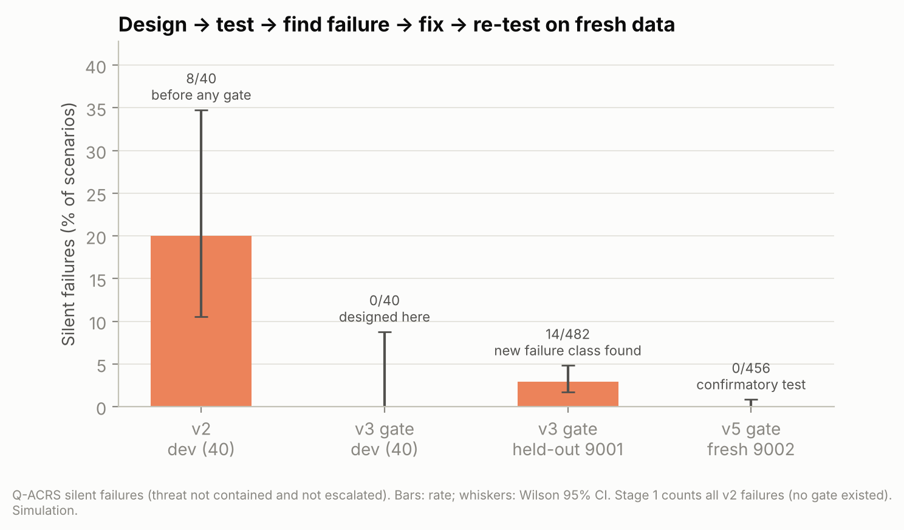

# Q-ACRS — Results v4 and v5

> Generated by `python -m qacrs.report_v45` from `backend/qacrs/results/v4` and `v5`. Criteria fixed in advance in `PREREGISTRATION_v4.md` and `PREREGISTRATION_v5.md`. Simulation unless stated.

## v4 — Held-out scenarios (seed 9001), confirmatory statistics

482 scenarios after dropping 18 duplicates.

| Method | Contained (Wilson 95%) | Escalated | Silent | Rejected (unsafe) | Services down |
|---|---|---|---|---|---|
| Full isolation | 293 (60.8%, 56.4%–65.0%) | 0 | 0 | 189 | 320 |
| Full isolation (safe) | 401 (83.2%, 79.6%–86.3%) | 81 | 0 | 0 | 320 |
| Per-machine rule | 221 (45.9%, 41.5%–50.3%) | 133 | 128 | 0 | 5 |
| Q-ACRS + v3 gate | 306 (63.5%, 59.1%–67.7%) | 162 | 14 | 0 | 0 |

| Hypothesis | Result | Verdict |
|---|---|---|
| H1-v3 (≥80% containment of safe full isolation AND fewer services down) | ratio 0.7631; services 0 vs 320 | **not supported** |
| H2 (silent failures: Wilson upper ≤ 2%) | 14/482 = 2.9%, CI 1.7%–4.8% | **not supported** |
| H3 (fewer services down per scenario, Wilcoxon one-sided) | p = 1.4e-33 (184 non-tied pairs) | supported |
| H4 (containment differs, exact McNemar) | Q-ACRS-only 0 vs safe-full-only 95, p = 5.0e-29 | safe full isolation contains more |

Bootstrap 95% CI (Q-ACRS − safe full isolation): containment rate -0.232 to -0.162; services down per scenario -0.749 to -0.581.

**What failed and why:** every silent failure had **both twins of a service hacked**: Q-ACRS isolated one twin to keep the service up and left the other restricted (open path to the database or high risk). The v3 gate did not cover this case → v5.

## v4 — Real-kernel validation (Linux iptables + real TCP, isolated container)

280 runs (140 scenarios × Q-ACRS and safe full isolation), **5824 real connection checks, 0 mismatches → agreement 100.0%** (H5 supported). Checks cover the attacker channel, every service path, every lateral path to a critical server, and every healthy machine; both blocked and open outcomes are tested. Median time to apply a policy: 5.59 ms. 29 links into an already-hacked critical server were logged separately (outside the C1 definition, by design). Executor outcomes: APPLIED 163, APPLIED_WITH_ESCALATION 62, BLOCKED_AWAITING_APPROVAL 54, NOT_CONTAINED_ESCALATE 1.

Scope: one Linux kernel, loopback addresses; validates decision → firewall rules → traffic, not detection or a hospital network.

## v5 — Twin-dilemma gate (G3), confirmed on a fresh held-out set (seed 9002)

| Set | n | Silent failures, v3 gate | Silent failures, v5 gate (Wilson 95%) | Escalation rate v3 → v5 | H2-v5 |
|---|---|---|---|---|---|
| **9002 (confirmatory, never seen)** | 456 | 13 | 0 (0.0%–0.8%) | 32.9% → 35.7% | supported |
| 9001 (G3 designed here) | 482 | 14 | 0 (0.0%–0.8%) | 33.6% → 36.5% | supported |
| development | 40 | 0 | 0 (0.0%–8.8%) | 20.0% → 20.0% | not supported (n too small for the bound) |

On 9002: H1-v3 ratio 0.8139 → supported; H3 p = 1.9e-32; McNemar: Q-ACRS-only 0 vs safe-full-only 67.

**Cost of G3:** escalations rise by 2.9% of incidents; overall 35.7% of held-out incidents need a human decision with a concrete recommended action. That is the price of never failing silently, and it is reported as a limitation.

**H1 across sets:** containment ratio 0.7631 (9001) vs 0.8139 (9002) — borderline around the 80% threshold. Q-ACRS contains fewer incidents automatically than safe full isolation in every set (McNemar), while taking down zero services.

